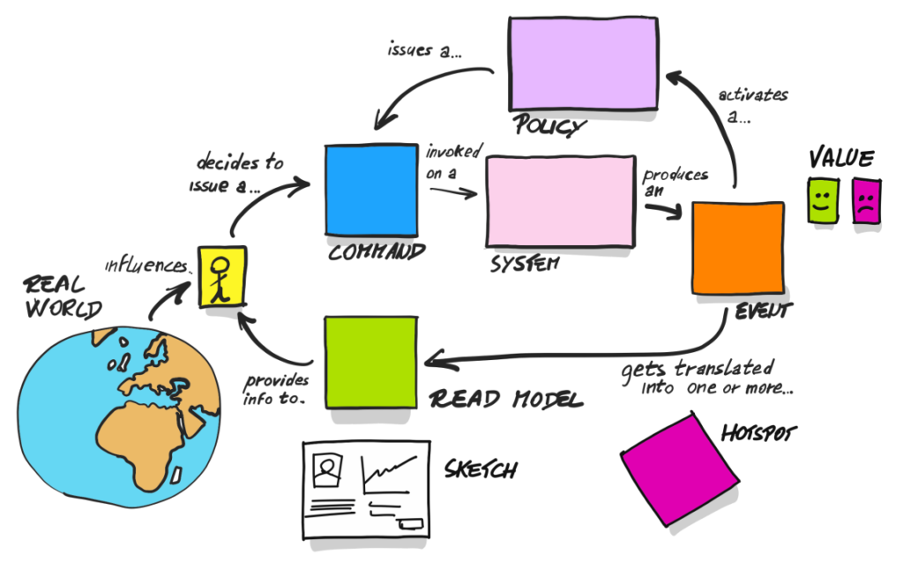

### Table of Contents

- [Table of Contents](#table-of-contents)
- [First... time travel back to Plato](#first-time-travel-back-to-plato)
- [The Picture that Explains Everything](#the-picture-that-explains-everything)
- [Let's zoom in on Systems](#lets-zoom-in-on-systems)
- [Oh CRUD](#oh-crud)
- [SQL](#sql)
  - [READ](#read)
  - [CREATE](#create)
  - [UPDATE](#update)
  - [DELETE](#delete)
  - [Raw Vs ORM Vs Query Builders](#raw-vs-orm-vs-query-builders)
- [What is State?](#what-is-state)
- [Combining Event Streams into Read Models](#combining-event-streams-into-read-models)
- [Domain Driven Design (DDD)](#domain-driven-design-ddd)
- [TDD](#tdd)
- [Overview of AWS and Serverless](#overview-of-aws-and-serverless)
- [Review](#review)


### First... time travel back to Plato

Imagine a group of people, chained to the wall of a cave all their lives, facing a blank wall.

The people watch shadows dance across their wall all the day long, projected as objects pass by a fire just outside the cave. They give these shadows names, and try to understand their behavior, but will never truly understand the actual identity of the object themselves.

In many ways, software is a perfect representation of Plato's allegory of the cave.

We as programmers create a simulation of a world, but that simulation will never accurately represent or understand the world. In fact, the simulation affects behaviors in the real world, making it even harder to simulate.

### The Picture that Explains Everything



> Credit: Alberto Brandolini

If we break software down into it's distinct parts, we identify a few different pieces:

1. The "Real World". Without it, the software is meaningless
2. The "User". The User acts as the interface between the Real World and the software
3. "Views / Read Models". The User is shown some representation of information in the system which is valuable in some way. This influences the User in the Real World and in the User's interaction with the software.
4. "Commands". The User may issue commands based on some combination of their internal state, the state of the Real World, and the information presented in the Views. Notably, Commands can also be invoked by Policies... more on that in a minute.
5. "Systems". This is the entity which handles the command. Commands may affect their internal state.
6. "Events". Systems will emit events based off of their internal state which are then handled by Policies or by Read Models.
7. "Policies". These listen for particular sequences of events from several systems, and invoke commands on systems when they occur.

Different software architectures will blend several of these steps into one, which decreases working complexity, but increases the effort required to represent complex processes. Combining everything into one whole is called a "monolith".

Breaking them out as distinct entities increases working complexity, but decreases the effort required to represent complex processes. Breaking these down into atomic, distributed, independent units is known as "microservices".

> Please note that you can break these down into interdependent, distributed pieces. This is called a distributed "ball of mud". Centralized balls of mud are far easier to reason about than decentralized balls of mud. Will we come up with something worse down the line? Absolutely.

> Also note that we can also break these into logical pieces and store it all in the same server and repo. This is called a modular monolith, and it is a joy to work with.

When we talk backend, typically, we are talking about Commands, Policies, Systems, and Events.

### Let's zoom in on Systems

A system can be broken down into the following pieces. Note that each of these pieces are mostly interdependent:

1. Business Logic. Of the different pieces, this should be the most independent. It takes provided information and some command, and returns the new state. This should be well tested via tests.
2. Persistence. This handles communicating with some kind of data store to retrieve and update current state.
3. Service. This composes the persistence and logic together into a cohesive whole.

If we break this out into the simplest flow, it would look something like this:

1. Command received.
2. Service layer asks the persistence layer for current state.
3. Service layer presents the current state and the command to the logic layer
4. Logic layer returns new state
5. Service layer presents new state to the persistence layer to update.
6. Event representing the change is emitted

### Oh CRUD

CRUD based persistence is extraordinarily common.

Create
Read
Update
Delete

The two most common flavors you will see are:

1. Relational Data Stores: Data is stored in "tables". Tables can reference other tables, and join data together based on keys. Schemas are defined upfront, making all data normalized. Ad hoc queries are relatively easy to put together, but in general, is slow. You can create indexes to speed up queries, but this has an inverse effect on writes. You can add in constraints to ensure data integrity, but this likewise slows down writes. Partitioning may be required as data volume increases, but this can be difficult.
2. Document Stores: Data is stored in "documents". A single document will have everything pertaining to an entity stored in a single place. This makes it extraordinarily fast to read by id, write, and easy to partition. But... ad hoc queries become difficult. Understanding and planning for data access patterns are a must. And, many do not enforce a schema, meaning you will need to account for schema drift and manual resolutions.

Regardless, the CRUD mentality can frequently leak into our representation of the world...

Do you create a friend? Or do you connect?

Do you update your address, or do you move?

Do you delete a part, or do you deprecate or archive it?

The language we use in the software impacts the use, the understanding, and the fit to the problems the software is solving.

Consider the difference in conversations:

> When an inventoryItem is deleted, we make sure to update the outboundInventory inventoryItem ids to become null for that inventoryItem.

Versus

> When we archive a part, we make sure it is hidden from the UI so you don't see it unless the "show archived parts" checkbox is selected. Archived parts cannot be used for new orders, but deprecated parts can be. Once a deprecated part has been depleted in inventory, it will automatically shift to be archived. If an archived part has an associated, new version, typing in the archived part number will present the new part as a suggestion to ease the transition for our reps.

The first is "dev talk". Business owners' eyes rollback, they say, "yes, that sounds good" and walk away confused. And then, the devs catch fire for the misunderstanding. In the real world, you cannot delete a part, its history, and you actually probably don't want to erase it from all of your internal records... and what the heck does null mean?

The second can be followed by both technical and non technical users - it uses commands, events, policies, views, and systems which directly match the context. For kicks and giggles, let's extract them:

- Views: ArchivedParts, ActiveParts (includes deprecated and archived part mappings)
- Policies: Archive part if it has been deprecated and depleted
- Commands: Archive Part, Deprecate Part, Associate New Part Version
- Events: Part Deprecated, Part Archived, Part Version Associated, Part Depleted, Order Created
- Systems: Inventory, Sales

The crucial differences between the two are the language used, expressing things in terms of events and commands or in terms of objects and attributes, and and having the business logic in the system or in the mind of the user.

### SQL

RDSs typically use some flavor of SQL.

Let's practice together

#### READ

```ts
type UserRecord = {
  id: number;
  first_name: string; 
  last_name: string;
  boss_id: number;
}

type BossRecord = {
  id: number;
  boss: string;
}
// SQL select to retrieve data from a table
const rows: Pick<UserRecord, 'first_name' | 'last_name'>[] = sql`SELECT first_name, last_name from User`;

// Apply where conditions to filter
// And use * to say all fields
// And, use order by to sort as needed!
const rows: UserRecord[] = sql`
SELECT * FROM User 
  WHERE 
    (
      first_name = "Asher" 
      AND last_name="Gunsay"
    ) 
    OR id > 200
    OR last_name LIKE "%say")
  ORDER BY last_name DESC`;

// Joins allow us to merge several tables together
const rows: { fname: string, boss: string }[] = sql`
SELECT 
  fname, 
  boss 
FROM User 
INNER JOIN 
  Boss on User.boss_id = Boss.id`;

const rows: { fname: string, boss: string | undefined }[] = sql`
  SELECT 
    fname, 
    boss 
  FROM User 
  LEFT JOIN 
    Boss on User.boss_id = Boss.id`;

/*
  Consider a Venn Diagram

  INNER JOIN is the intersection of the two circles

  LEFT JOIN is the the entire left circle, and the data of the right circle if it exists in the left.
  
  If you feel like you need the others (right and full)... double check what you are doing...
*/

// We may use a query builder like Drizzle to make it easier (and typesafe!) for these queries:

// typed: {firstName: string, lastName: string, boss: string}[] automagically!
const userRows = db.select({
  firstName: userTable.firstName, 
  lastName: userTable.lastName,
  boss: bossTable.boss,
})
  .from(userTable)
  .innerJoin(bossTable)
  .where(
    and(
      or(
        eq(userTable.firstName, "Asher"),
        eq(userTable.lastName, "Gunsay"),
      ),
      lte(userTable.id, 1000)
    )
  )

// Or, we may use an ORM to abstract db access away. Doing this less now tho...

const users = User.findAll({
  attributes: ['first_name', 'last_name'],
  include: [{
    model: Boss,
    attributes: ['name'],
  }],
  where: {
    [Op.and]: [ // Note the use of symbols to prevent object sql injection
      {
        [Op.or]: [
          {firstName: 'Asher'},
          {lastName: 'Gunsay'}
        ],
      },
      {id: {
        [Op.lte]: 1000,
      }}
    ],
  }
})
```

#### CREATE

```ts

// Insert command creates one or many records
sql`
INSERT INTO User 
  (first_name, last_name) 
VALUES 
  ("asher", "gunsay"), 
  ("steve", "wonziac")
`

// In drizzle

db.insert(userTable)
  .values([
    {firstName: 'asher', lastName: 'gunsay'}, 
    {firstName: 'steve', lastName: 'wonziac'},
  ])

// In Sequelize

User.bulkCreate([
  {firstName: 'asher', lastName: 'gunsay'}, 
  {firstName: 'steve', lastName: 'wonziac'},
])
```

#### UPDATE

```ts
sql`
UPDATE
  User
SET 
  first_name = "lol", 
  last_name = "suckas"
`

// How many records changed? All of them...
// Make sure to use a WHERE so we can make this better, obv.
sql`
UPDATE
  User
SET 
  first_name = "lol", 
  last_name = "suckas"
WHERE
  id > 100
`

// In drizzle

db.update(userTable)
  .set({
    firstName: 'lol',
    lastName: 'suckas',
  })
  .where(
    gt(userTable.id, 100)
  )

// In Sequelize
user.update({ // if we have an "active record"
  firstName: 'lol', 
  lastName: 'suckas'
})

User.update( // if we don't or we want to bulk update
  {
    firstName: 'lol', 
    lastName: 'suckas'
  }, 
  {
    where: { 
      id : {
        [Op.gt]: 100 
      }
    }
  })
```

#### DELETE


```ts
sql`
DELETE FROM User
`

// :o

sql`
DELETE FROM User
WHERE id > 100
`
// :)

// Drizzle

db.delete(userTable)
  .where(gt(userTable.id, 100))

// Sequelize
user.delete() // if an active record
User.delete({where: {
  id: {
    [Op.gt]: 100,
  }
}})
```

#### Raw Vs ORM Vs Query Builders

|                Feature |  Raw  |  ORM  | Query Builder |
| ---------------------: | :---: | :---: | :-----------: |
|              Type Safe |       |   Y   |       Y       |
|   Can do any operation |   Y   |   -   |       Y       |
|        Teaches you raw |   Y   |       |       Y       |
|          Transferrable |   Y   |       |       Y       |
|  Catch Stupid Mistakes |       |   Y   |       Y       |
|     Relations are easy |       |   Y   |               |
| Active Record Patterns |       |   Y   |               |
|            Lightweight |   Y   |       |       Y       |

SQL is an important skill - if you don't know how to read it, you won't be able to debug why the ORM is not working the way you want it to.

And... that's one of the biggest reasons I've personally moved away from ORMs to Query Builders where possible.

Query Builders also have the advantage of being much more light weight for serverless applications, and using DDD patterns removes much of the benefit of active records...

### What is State?

So... what's an alternative to CRUD? Let's first examine what state even is:

Referencing our "Model Of Everything", we see the flow looks like this:

`State => Command => Event => New State`

We can collapse this to:

`State => Event => New State`

We can expand this to:

`State - 1 => Event => Event => New State`

And further expand this to:

`Reduce(Past Events) => New Event => New State`

So:

`State = Reduce(Events)`

We could write it as a literal reduce function:

```js
const events = [event1, event2]
// State after applying 2 new events to our current state
const newState = events
  .reduce(
    (state, nextEvent) => applyEvent(state, nextEvent), 
    currentState
  )
```

So, we in effect transform CRUD into CR...

Instead of:
```ts
type ShoppingCart = {
  id: number;
  user: User;
  items: Product[];
  availableUntil: Date;
  lastActive: Date;
  createdAt: Date;
}

const cart: ShoppingCart = {
  id: 100,
  user: steve;
  items: [{id: 1, name: 'apple', quantity: 2}],
  availableUntil: new Date(),
  lastActive: new Date(),
  createdAt: new Date(),
}
```

We have:
```ts
  type ProductAddedToShoppingCartEvent = {
    type: 'ProductAddedToShoppingCart';
    at: Date;
    shoppingCartId: ShoppingCart['id'];
    productId: Product['id'];
  }
  type ProductRemovedFromShoppingCartEvent = {
    type: 'ProductRemovedFromShoppingCart';
    at: Date;
    cartId: ShoppingCart['id'];
    productId: Product['id'];
  }
  type ShoppingCartReservedEvent = {
    type: 'ShoppingCartReserved';
    at: Date;
    cartId: ShoppingCart['id'];
    userId: User['id'];
  }
  type ShoppingCartExpiredEvent = {
    type: 'ShoppingCartExpired';
    at: Date;
    cartId: ShoppingCart['id'];
  }

  type ShoppingCartEvent = 
    | ProductAddedToShoppingCartEvent
    | ProductRemovedFromShoppingCartEvent
    | ShoppingCartReservedEvent
    | ShoppingCartExpiredEvent;

  const shoppingCart = [
    {
      type: 'ShoppingCartReserved',
      at: new Date(),
      cartId: 100,
      userId: 176,
    },
    {    
      type: 'ProductAddedToShoppingCart',
      at: Date,
      shoppingCartId: 100,
      productId: 2
    },
    {
      type: 'ProductAddedToShoppingCart',
      at: Date,
      shoppingCartId: 100,
      productId: 3
    },
     {
      type: 'ProductRemovedFromShoppingCart',
      at: Date,
      shoppingCartId: 100,
      productId: 3
    },
    {
      type: 'ProductAddedToShoppingCart',
      at: Date,
      shoppingCartId: 100,
      productId: 2
    },
  ].reduce((state, event) => {
    switch(event.type) {
      case 'ShoppingCartReserved':
        return {
          items: new Map<Product['id'], number>(),
          createdAt: event.at,
          availableUntil: add(event.at, 3, 'days'),
        }
      case 'ProductAddedToShoppingCart':{
        const currentQuantity = state.items.get(event.productId) ?? 0
        state.items.set(event.productId, currentQuantity + 1)
        return state
      }
      case 'ProductRemovedFromShoppingCart':{
        const currentQuantity = state.items.get(event.productId) ?? 0
        if (currentQuantity <= 1) {
          state.items.delete(event.productId)
        } else {
          state.items.set(event.productId, currentQuantity - 1)
        }
        return state
      }
      /* And... so on */
    }
  }, {})
```

What the heck?! Storing events takes so much more boiler plate!

But... note that we now have access to so much more power... Want to generate an ai which recommends "Customers also viewed"? You've got the data. Want to see which items get removed from the cart most frequently? No problem. Want to see average cart lifetime? You bet.

Also, with the second, we are talking in terms of the business: Product was added then removed from the cart. Not an item being pushed then popped off an array.

You can only add to the list of events - you can never remove. Hence, we only have a Create and Read database. In other words, we have a log. And... that means we always know exactly how we ended up where we are.

Use CRUD when a system's workflow belongs in the user's head. Strongly consider event sourcing when it doesn't.

### Combining Event Streams into Read Models

Calling back to the beginning, when we discussed Plato's cave, it seems that we've accepted that our software will never truly model the objects well enough - instead, we will focus on just tracking what they do, what happened, and call that good.

We can then look through these histories, find patterns, and focus on particular points of interest.

But... scanning millions of event records sounds like it would be painfully slow for frequently used queries.

Yeah... it is.

Hence, we will use a read model to pull these events into easy to consume forms:

1. Command Accepted
2. System Emits Event
3. Read Model Intercepts Event and Updates Internals

We can have a single read model for a single system, or we could have 20, each focusing on different angles of the same series of events.

We could squish everything into a single database, and pray that it works for our needs, or we could take advantage of several databases, each solving particular needs in our read model.

Splitting our Read Model, our Views from our Systems is called Command Query Responsibility Segregation, or CQRS.

If you have separate datastores, you will introduce a delay between our Views and our System Datastores... this is called eventual consistency. The data in the view may be a bit stale... this seems terrifying as a dev. But... that's how the real world works. In fact, as soon as you've requested data from a database, that data is immediately stale once it's left. The real question is how stale is too stale? And that's something that can be worked on.

### Domain Driven Design (DDD)

This ultimately brings us to Domain Driven Design. It's been around since 2003, and is the current best practice for enterprise level software.

We've covered the fundamentals. We aren't going to cover the tactics covered in DDD as it's typically implemented via OOP, but I will lay out the strategy of DDD below:

1. Ubiquotous language. Make your software program almost readable by a non technical business stakeholder. Use their language.
2. Create separate Aggregates / Services / Consistency Boundaries. Internally, these will have their own data store (even if it's just a dedicated set of tables in a shared RDS), and will be internally, transactionally consistent. These aggregates can reference other aggregates, but only by the aggregate's root id. This forces clean separations.
3. Separate the business logic from the "repository" (the persistence layer), so they can be manipulated and changed separately, and to enable testing without mocks.

And that's it.

### TDD

We've talked a little about tests.

Let's talk a little more about them.

TDD is a simple loop which looks like this:

1. Write a failing test.
2. Make it pass.
3. Clean up the code so it still passes.

We do not practice a strict adherence to TDD. But, I've found that especially initially, it can help you work out the most important parts of a function: what is the ideal input and what is the ideal output. Then, all you need to do is figure out the transformation that needs to occur.

TDD is fantastic when going back to code as it serves as a change log and documentation for how the software should behave.

In our layers, the area we are most consistent and diligent about testing is the logic layer.

When considering tests (and the code to get them to pass!) to write, ZOMBIES can be helpful to consider:

Zero
One
Many
Boundaries
Interfaces
Exceptions
Simplify

```ts

// Let's do FizzBuzz with TDD:

// Given 'n' representing the size of an array
// Fill the array where i is the 1-index position
// return "FizzBuzz" if i divisible by 3 and 5
// return "Fizz" if i divisible by 3
// return "Buzz" if i divisible by 5
// return i otherwise
// So... fizzBuzz(3) => [1, 2, "Fizz"]

```

### Overview of AWS and Serverless

Now, with all of this in our minds, let's talk about the specific tools we have in AWS:

- Lambda: Serverless function which can be triggered in a variety of ways. This is how we program the system to do things.
- S3: Serverless file storage.
- DynamoDB: Serverless document database
- EventBridge: Serverless event bus - lambdas can emit events to it and be triggered from it.
- Api Gateway: Serverless api definition - lambdas can be triggered from it
- SQS: Serverless queue. We can smooth out spikes in workloads by using it. This is critical especially for server-based workloads
- Fargate: "Serverless" container service. Great for computationally heavy tasks that take a while (> 15 minutes)

Combining these together, we could see a flow that looks like this:

1. Frontend hits API Gateway
2. Api Gateway calls a Lambda
3. Lambda makes a call to DynamoDB to get / update data
4. Lambda emits an event to EventBridge
5. Lambda returns data back to Api Gateway for the user
6. Event Bridge notifies an SQS queue to put on a new task
7. Fargate wakes up and starts processing the SQS tasks
8. Fargate takes the results and stores it in a report on S3
9. Fargate emits an event
10. Lambda is triggered by event and sends an email informing about the new report being available

Rather than needing to log directly into the cloud and spin up these services manually, we define the infrastructure using code, and it automatically spins itself up. This is known as Infrastructure as Code (IaC) and is incredibly powerful for spinning up new environments (personal, shared dev, staging, beta, beta2, productionA, productionB... whatevs you want).

### Review

Jk. Nothing to see here.

Locking these concepts in takes time, patience, and a ton of mistakes across many projects.

Keep an open mind, learn from the many mistakes in the projects you will work on, and soon enough, you be making those mistakes on your own!