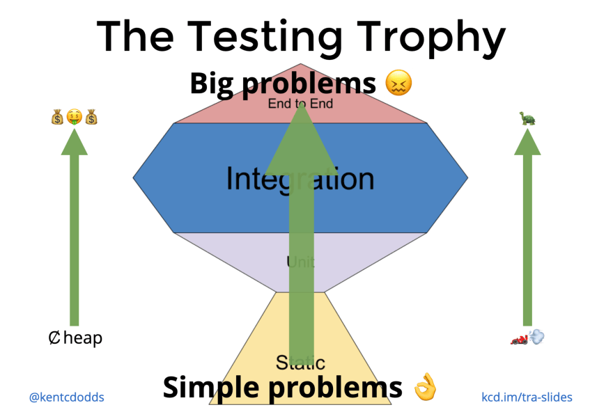

### Table of Contents

- [Table of Contents](#table-of-contents)
- [FP vs OOP](#fp-vs-oop)
- [So... Why Typescript?](#so-why-typescript)
- [Now... Let's dive in!](#now-lets-dive-in)

### FP vs OOP

|                        Feature | Object Oriented Programming | Functional Programming |
| -----------------------------: | :-------------------------: | :--------------------: |
|            First Class Citizen |           Classes           |       Functions        |
|                   Polymorphism |  Interfaces / Inheritance   |  Function parameters   |
|                       Behavior |          Inherited          |        Composed        |
| Data and Function Relationship |            Bound            |        Separate        |
|         Relationship to Change |          Mutations          |         Purity         |
|              Higher Level View |         Simulation          |     Transformation     |

Perhaps oddly, languages have taken to supporting both as they each have powerful attributes.

### So... Why Typescript?

> Credit: Kent C. Dodds

1. Static analysis is a fast sanity check. It catches stupid errors like forgetting to unwrap optionals, misspellings, and so on.
2. It serves as documentation
3. It helps with autocomplete

### Now... Let's dive in!

Go through the following files in this order:

1. primitives.ts
2. data-structures.ts
3. functions.ts
4. types.ts
5. review.ts

